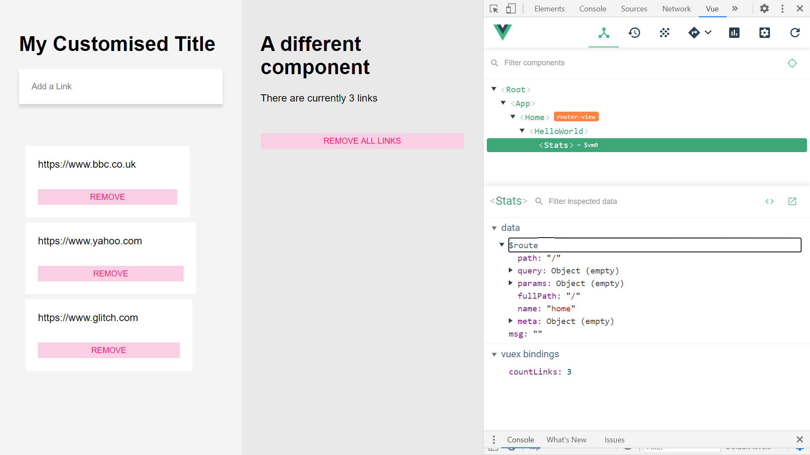

# :zap: Vuex State Management

* Vue app to learn about state management using Vuex.
* **Note:** to open web links in a new window use: _ctrl+click on link_


## :page_facing_up: Table of contents

* [:zap: Vuex State Management](#zap-vuex-state-management)
  * [:page_facing_up: Table of contents](#page_facing_up-table-of-contents)
  * [:books: General info](#books-general-info)
  * [:camera: Screenshots](#camera-screenshots)
  * [:signal_strength: Technologies](#signal_strength-technologies)
  * [:floppy_disk: Setup](#floppy_disk-setup)
  * [:computer: Code Examples](#computer-code-examples)
  * [:cool: Features](#cool-features)
  * [:clipboard: Status & To-Do List](#clipboard-status--to-do-list)
  * [:clap: Inspiration](#clap-inspiration)
  * [:file_folder: License](#file_folder-license)
  * [:envelope: Contact](#envelope-contact)

## :books: General info

* Uses the Vue javascript framework with Vuex state management to create a simple webpage, add weblinks to a list and remove them using mutation.
* Vuex designates a central location where the state data is stored, modified and accessed. Vuex is more suitable for larger Vue apps but the objective here was to learn how it works and then add to the app complexity later.
* Mutations are used for synchronous events. Actions are used for asynchronous events.

## :camera: Screenshots

.

## :signal_strength: Technologies

* [Vue framework v2](https://vuejs.org/)
* [Vuex v3](https://github.com/vuejs/vuex) a central location from which state data is stored, modified and accessed.
* [Vue CLI v4](https://github.com/vuejs/vue-cli)
* [Vue DevTools extension for Chrome](https://chrome.google.com/webstore/detail/vuejs-devtools/nhdogjmejiglipccpnnnanhbledajbpd) was useful for debugging and seeing what was happening with the state when Vuex was used.

## :floppy_disk: Setup

* Run `npm i` to install dependencies
* Run `npm run serve` for a dev server. Navigate to `http://localhost:8080/`. The app will automatically reload if you change any of the source files.

## :computer: Code Examples

* extract from the `store.js` file, code for mutations and actions

```javascript
mutations: {
    ADD_LINK: (state, link) => {
      state.links.push(link)
    },
    REMOVE_LINK: (state, link) => {
      state.links.splice(link, 1)
    },

    // remove all empties the array
    REMOVE_ALL: (state) => {
      state.links = []
    }
  },
  actions: {
    removeLink: (context, link) => {
      context.commit("REMOVE_LINK", link)
    },
    removeAll({commit}) {
      return new Promise((resolve, reject) => {
        setTimeout(() => {
          commit('REMOVE_ALL')
          resolve()
        }, 1500)
      })
    }
  }

```

## :cool: Features

* Vuex mutations used to add a payload 'link' to the links array in the `/src/store.js` file

```javascript

  mutations: {
    ADD_LINK: (state, link) => {
      state.links.push(link)
    }
  },
```

* [Promise.resolve()](https://developer.mozilla.org/en-US/docs/Web/JavaScript/Reference/Global_Objects/Promise/resolve) used in removeAll() function.

## :clipboard: Status & To-Do List

* Status: Working. Updated june 2021.
* To-Do: Nothing

## :clap: Inspiration

* [A Vuex Tutorial by Example - Learn Vue State Management by Gary Simon - mar 17, 2018](https://coursetro.com/posts/code/144/A-Vuex-Tutorial-by-Example---Learn-Vue-State-Management).
* [Luuk Gruijs, Medium article, "Understanding, creating and subscribing to observables in Angular"](https://medium.com/@luukgruijs/understanding-creating-and-subscribing-to-observables-in-angular-426dbf0b04a3)

## :file_folder: License

* This project is licensed under the terms of the MIT license.

## :envelope: Contact

* Repo created by [ABateman](https://github.com/AndrewJBateman), email: gomezbateman@yahoo.com
